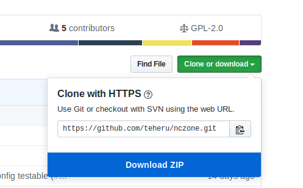
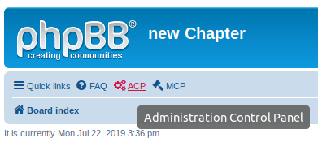
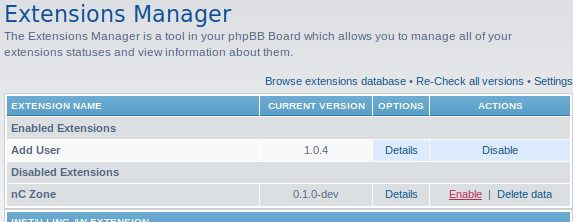
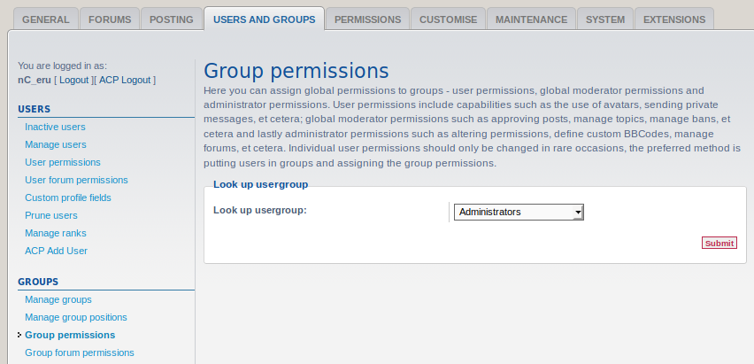
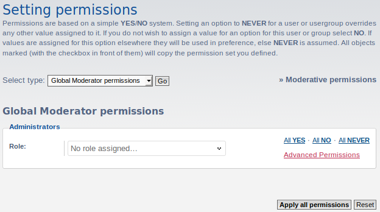
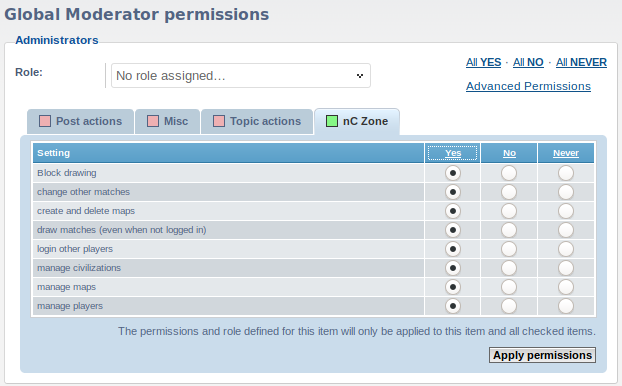
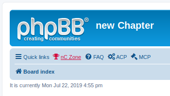

# nC Zone

## Installation

### Installing phpBB3

First of all, you need to install the most recent version of phpBB3. Since
[there already is a good guide](https://www.phpbb.com/community/docs/INSTALL.html) to install phpBB3, we leave this part
out.

However, since we are are only a small developer team, we don't try to match all phpBB3 dependencies. In our production
environment, we current use
 * PHP 7.2
 * MariaDB 10.1

Other environments might work just fine, but they might also be some issues, we didn't test it. If you have issues using
a different environment, please create an issue or a pull request!

### Installing nC Zone

There are currently two options to install the nC Zone. You can either clone the repository using git or download a ZIP
and extract that one. We recommend using git, because right now we don't push releases with a version number but just
develop on the master and using git makes it easier to update. However, aside from a little more work, it's perfectly
fine to download and use a ZIP and it's probably the better way if you don't know git.

#### Using git

Find your `ext` directory in the root path of your phpBB3 installation. In this directory, create a new directory called
`eru`. Clone this repository into that directory so the path looks like

```
/path/to/your/phpBB3/ext/eru/nczone/ext.php
```

Skip the next chapter explaining how to perform these steps using a ZIP file and go on reading
[Installing the extensions](#Installing-the-extension).

#### Using a ZIP file

Find your `ext` directory in the root path of your phpBB3 installation. In this directory, create a new directory called
`eru`. Find the `Clone or download` button above, click on it and then click `Download ZIP`.



Move the ZIP to the
directory you just created and extract its content. Rename the `nczone-master` directory to `nczone`, so the path looks
like

```
/path/to/your/phpBB3/ext/eru/nczone/ext.php
```

#### Installing the extension

Login to your phpBB3 installation and go into the ACP



Go to the `Customise` tab


Click `Enable` next to `nC Zone`.



You now have a (not yet completely) running nC Zone :) ! Please keep on reading the next chapter.

### Configure your Zone

To configure your Zone, go on the `Extensions` tab in the ACP (see above).


Look for `nC Zone` in the menu on the right


Click through the sub-categories. The default values for all settings should contain sane values, but you might want
tweek some configurations. Hopefully, all configurations are self explanatory, if not, please feel free to open an
issue. Please also take a look at the following topics of this README to see how to find out forum and post IDs.

#### Setting up a Forum for posting matches

First of all, you need a forum where matches can be posted. Take a look at
[this guide](https://www.phpbb.com/support/docs/en/3.2/ug/quickstart/forums/) to see how to create one. We recommend to
give no one permission to create a topic in this forum, since the Zone will create a new topic for every match. After
you created your forum, go back to the board overview and click on the newly created forum. Take a look at the URL field
of your Browser, it should say something like `https://new-chapter.eu/viewforum.php?f=110` (with you own domain of
course). Copy the number which follows after the `f=`, so in this case `110`.

Go back to the ACP and click on `Extensions`


Under `nC Zone` on the left click on `General Settings`


Look for `Post forum ID` on the right and fill the number you just copied in the belonging field.

#### Setting up Rules for your Zone

In a forum of your choice (can but don't have to be public visible), create a topic containing the rules which should
apply in your Zone. Save the post and go to the topic. Click on the small icon marked in the following image


Take a look at the URL field of your Brwoser, it should say something like
`https://new-chapter.eu/viewtopic.php?p=132869#p132869` (with your own domain of course). Copy the number which follows
after the `p`, so in this case `132869`.

Under `nC Zone` on the left click on `General Settings`


Look for `Rules post ID` on the right and fill the number you just copied in the belonging field.

#### Setting up Civilisations

The Zone was primarily designed for Age of Empires II, but it should work for most RTS games. In order to not limit
ourselves to a single game, we decided to not ship civilisations (in short: civs) by default. For drawing matches, it's
is however required to have civs. You can either [create them by hand](#Creating-your-own-civilisations), or, if you're
playing the most recent version of Age of Empires II,
[take the ones we already prepared](#Apply-our-prepared-civilisations-for-Age-of-Empires-II).

##### Creating your own civilisations

In order to create civs, you have to have the privileges to do so. You can get the privileges by for example assigning
them to the Administrator group. But it is also possible to assign them to a dedicated group or even a single user in a
similar way like described below.

In the ACP, go to the `Users and Groups` tab


Click on `Group permissions` on the left, select Administrators in the drop down menu and click on `Submit`



In the drop down menu on the top, select `Global Moderator permissions`, click on `Go` and then click on
`Advanced Permissions`



Click on the `nC Zone` tab and then on `Yes` to give all permissions to the Administrator group



Confirm by clicking `Apply permissions`.

Now go back to the front page of your board and click on nC Zone in the menu



Afterwards, click on `MCP` in the same menu. Click on the `nC Zone` tab


Now click on the `Civilisations` tab on the left. From here on, everything should be self-explanatory :) . If not, feel
free to open an issue.

##### Apply our prepared civilisations for Age of Empires II

**This wont work if you already have manually created civs before. If you have created civs before you have to delete
them by truncating the `phpbb_zone_civs` table before.**

You can apply our prepared civilisations for the most recent Age of Empires II HD version (there are more civs coming
with Age of Empires II Definitive Editions), by executing the following MySQL query on your database:

```mysql
INSERT INTO `phpbb_zone_civs` VALUES (1,'NCZONE_AZTECS'),(2,'NCZONE_BERBERS'),(3,'NCZONE_BRITONS'),(4,'NCZONE_BURMESE'),(5,'NCZONE_BYZANTINES'),(6,'NCZONE_CELTS'),(7,'NCZONE_CHINESE'),(8,'NCZONE_ETHIOPIANS'),(9,'NCZONE_FRANKS'),(10,'NCZONE_GOTHS'),(11,'NCZONE_HUNS'),(12,'NCZONE_INCAS'),(13,'NCZONE_INDIANS'),(14,'NCZONE_ITALIANS'),(15,'NCZONE_JAPANESE'),(16,'NCZONE_KHMER'),(17,'NCZONE_KOREANS'),(18,'NCZONE_MAGYARS'),(19,'NCZONE_MALAY'),(20,'NCZONE_MALIANS'),(21,'NCZONE_MAYANS'),(22,'NCZONE_MONGOLS'),(23,'NCZONE_PERSIANS'),(24,'NCZONE_PORTUGUESE'),(25,'NCZONE_SARACENS'),(26,'NCZONE_SLAVS'),(27,'NCZONE_SPANISH'),(28,'NCZONE_TEUTONS'),(29,'NCZONE_TURKS'),(30,'NCZONE_VIETNAMESE'),(31,'NCZONE_VIKINGS'),(32,'NCZONE_FREEPICK');
```

If you don't know what this means, it's probably easier to manually create civs like described in the step before :) .

If you have created maps before, you need to create the map-civ-entries in the database by executing the following MySQL
query.

```mysql
insert into phpbb_zone_map_civs select m.map_id, c.civ_id, 0.0, 0, 0, 0 from phpbb_zone_maps m join phpbb_zone_civs c;
```

Note, that the civ names in the SQL query look a little bit strange. That's because civs names are language variables.
This way every user can have the civ names in his own language (but we only have English and German right now, feel
free to add more language by adjusting [lang.json](https://github.com/teheru/nczone/blob/master/config/lang.json)).

#### Setting up maps

Setting up maps works pretty much the same like [setting up civilisations](#Setting-up-Civilisations). We don't have
prepared maps for you, though, because they change pretty often. However, feel free to contact @mcepok if you still want
the maps we currently use.

#### Activating players

To activate players, again, look at [Setting up Civilisations](#Setting-up-Civilisations) to give yourself the needed
privileges and to find the MCP. In the MCP menu, this time, stay on `Player` in the left menu, and enter a name (e. g.
your own) in the field and click `Submit`


In the following screen, give the user a start rating and make sure to tick the checkbox `Activate`. Again, click
`Submit`.


Do the same with some more players and if you followed everything mentioned above, you should be able to use your very own
Zone :) .

#### Setting up a better Style

While the default prosilver Style should work, it didn't received a lot of love from us. We
use the [flat style](https://www.phpbb.com/customise/db/style/flat_style/) for our Zone.

## License

[GPLv2](LICENSE)
